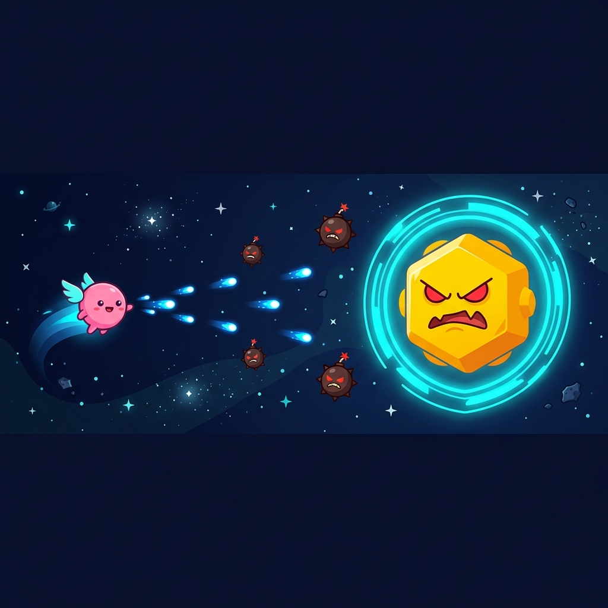

<p align="center">
  
</p>

<h1 align="center">👑 Crown Pilot</h1>

<p align="center">
  <b>An endless sky-flyer game built for Apple Watch using SpriteKit and SwiftUI.</b>
</p>

<p align="center">
  
  
  
  
  
</p>

---

## 🎮 About

**Crown Pilot** is an endless side-scrolling sky-flyer designed from the ground up for Apple Watch. Use the **Digital Crown** to control altitude, dodge floating islands, airships and storm clouds, fly through golden rings for bonus distance, and tap to **boost** — all on your wrist.

### Features

- 🕹️ **Digital Crown flight** — Velocity-based controls with gravity and air drag
- 💨 **Tap to boost** — 2.2× speed burst for dodging and distance
- 🏝️ **Obstacles** — Floating islands, airships with propellers, storm clouds with lightning
- 💍 **Golden rings** — Fly through them for +30 metres bonus
- 🌅 **Parallax sky** — Gradient sky, sun glow, multi-layer scrolling clouds
- 👨‍✈️ **Rayman-style pilot** — Headband, goggles, floating hands, wing-pack
- 📊 **Best score tracking** — Persistent high score via UserDefaults
- 🎬 **Three screens** — Title → Gameplay → Game Over with score card

---

## 🏗️ Architecture

```
CrownPilot/
├── CrownPilotApp.swift    # @main entry point
├── ContentView.swift      # SwiftUI: Digital Crown velocity input + tap boost + SpriteView
├── GameScene.swift        # Game loop: state machine, physics, spawning, collisions, HUD
├── GameEntities.swift     # Entity factories: pilot, island, airship, storm, ring, cloud
├── SETUP.md               # Step-by-step setup guide
└── web-prototype/         # Original React/SVG design prototype
```

| Layer | Responsibility |
|-------|---------------|
| `ContentView` | Crown delta → velocity input, tap → boost/start, renders `SpriteView` |
| `GameScene` | State machine (title/playing/gameOver), physics, spawning, collisions, HUD |
| `GameEntities` | Visual factories for pilot character, obstacles, collectibles, clouds |

---

## 🚀 Quick Start

### Prerequisites

- **macOS** with **Xcode 15+** installed
- watchOS 10+ Simulator (included with Xcode)

### Using XcodeGen (Recommended)

```bash
brew install xcodegen
git clone https://github.com/HakanIST/CrownPilot.git
cd CrownPilot
xcodegen generate
open CrownPilot.xcodeproj
```

Select an **Apple Watch simulator** → **⌘R**.

> 📖 For detailed instructions, see [SETUP.md](SETUP.md).

---

## 🎯 How to Play

| Action | Simulator | Real Watch |
|--------|-----------|------------|
| Fly up/down | `⇧⌘↑` / `⇧⌘↓` or trackpad scroll | Rotate Digital Crown |
| Boost | Click on the watch screen | Tap the screen |

### Game Mechanics

- **Pilot** — Rayman-style character with headband and goggles. Auto-flies forward.
- **Digital Crown** — Adds velocity. Gravity pulls down, air drag slows movement.
- **Boost** — Tap for a 2.2× speed burst (0.7 seconds).
- **Obstacles** — Floating islands, airships, storm clouds. Hit one = crash.
- **Golden Rings** — Fly through for +30 metres. They wobble and shine.
- **Speed** — Gradually increases as you fly further.

### Scoring

Distance flown in **metres**. Best score persists between sessions.

---

## ⌚ Deploy to Real Apple Watch

1. **Xcode → Settings → Accounts** → Sign in with Apple ID
2. Select **Personal Team** under Signing & Capabilities
3. Connect iPhone (paired with Apple Watch) via USB
4. Enable **Developer Mode** on iPhone and Apple Watch
5. Select your Apple Watch → **⌘R**

> ⚠️ Free provisioning expires after 7 days.

---

## 🎨 Web Prototype

The `web-prototype/` directory contains the original interactive design built with React and SVG. Open `web-prototype/index.html` in a browser to explore:

- Live playable prototype with scroll/click controls
- Title, gameplay, and game-over screens
- Three sky moods (day, dusk, night)
- Anatomy diagrams (pilot sprites, sky entities, crown mapping)

---

## 📄 License

[MIT License](LICENSE)
