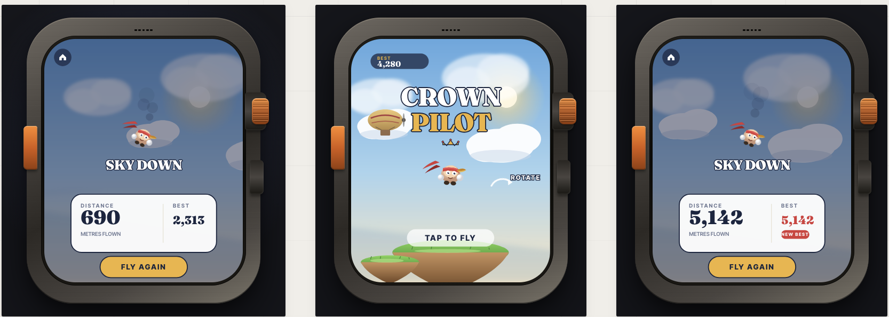

<p align="center">
  
</p>

<h1 align="center">Crown Pilot</h1>

<p align="center">
  <b>An endless sky-flyer game for Apple Watch, built with SpriteKit and SwiftUI.</b><br>
  <i>Apple Watch icin SpriteKit ve SwiftUI ile yapilmis sonsuz ucus oyunu.</i>
</p>

<p align="center">
  
  
  
  
</p>

---

## About / Hakkinda

**Crown Pilot** is an endless side-scrolling sky-flyer designed from the ground up for Apple Watch. Use the **Digital Crown** to control altitude, dodge floating islands, airships and storm clouds, fly through golden rings for bonus distance, and tap to **boost**.

**Crown Pilot**, Apple Watch icin sifirdan tasarlanmis sonsuz yana kayan bir ucus oyunudur. **Digital Crown** ile yuksekligi kontrol edin, yuzen adalari, hava gemilerini ve firtina bulutlarini atlatma yapin, bonus mesafe icin altin halkalardan gecin ve **boost** icin dokunun.

### Features / Ozellikler

| EN | TR |
|----|----|
| Digital Crown flight — Velocity-based controls with gravity and air drag | Digital Crown ucusu — Yercekimi ve hava surtusmeli hiz tabanli kontroller |
| Tap to boost — 2.2x speed burst for dodging | Dokunarak hizlanma — Kacis icin 2.2x hiz patlamasi |
| Obstacles — Floating islands, airships, storm clouds | Engeller — Yuzen adalar, hava gemileri, firtina bulutlari |
| Golden rings — Fly through for +30 metres bonus | Altin halkalar — Icinden gecin +30 metre bonus |
| Parallax sky — Gradient sky, sun glow, multi-layer clouds | Parallaks gokyuzu — Dereceli gokyuzu, gunes isigi, cok katmanli bulutlar |
| Rayman-style pilot — Headband, goggles, floating hands | Rayman tarzi pilot — Bandana, gozluk, havada duran eller |
| Best score tracking — Persistent high score | En iyi skor takibi — Kalici yuksek skor |

---

## Architecture / Mimari

```
CrownPilot/
├── CrownPilotApp.swift    # @main entry point / Giris noktasi
├── ContentView.swift      # SwiftUI: Digital Crown input + tap boost + SpriteView
├── GameScene.swift        # Game loop: state machine, physics, spawning, collisions, HUD
├── GameEntities.swift     # Entity factories: pilot, island, airship, storm, ring, cloud
├── Assets.xcassets/       # App icon and asset catalog
├── DEPLOYMENT.md          # Deployment and distribution guide / Dagitim rehberi
└── project.yml            # XcodeGen project definition
```

| Layer | Responsibility |
|-------|---------------|
| `ContentView` | Crown delta → velocity input, tap → boost/start, renders `SpriteView` |
| `GameScene` | State machine (title/playing/gameOver), physics, spawning, collisions, HUD |
| `GameEntities` | Visual factories for pilot character, obstacles, collectibles, clouds |

---

## Quick Start / Hizli Baslangic

### Prerequisites / Gereksinimler

- **macOS** with **Xcode 16+**
- watchOS 10+ Simulator (included with Xcode)
- XcodeGen: `brew install xcodegen`

### Build & Run / Derleme ve Calistirma

```bash
git clone https://github.com/HakanIST/CrownPilot.git
cd CrownPilot
xcodegen generate
open CrownPilot.xcodeproj
```

Select an Apple Watch simulator, then press **Cmd+R**.

Apple Watch simulatorunu secin, ardindan **Cmd+R** basin.

> For detailed setup, see [SETUP.md](SETUP.md). For deployment to real devices, see [DEPLOYMENT.md](DEPLOYMENT.md).

---

## How to Play / Nasil Oynanir

| Action / Aksiyon | Simulator / Simulator | Real Watch / Gercek Saat |
|-------------------|----------------------|--------------------------|
| Fly up/down / Yukari-asagi uc | Scroll or Shift+Cmd+Arrow | Rotate Digital Crown |
| Boost / Hizlan | Click on watch screen | Tap the screen / Ekrana dokun |

### Game Mechanics / Oyun Mekanikleri

- **Pilot** — Rayman-style character with headband and goggles. Auto-flies forward.
- **Digital Crown** — Adds velocity. Gravity pulls down, air drag slows movement.
- **Boost** — Tap for a 2.2x speed burst (0.7 seconds).
- **Obstacles** — Floating islands, airships, storm clouds. Hit one = crash.
- **Golden Rings** — Fly through for +30 metres. They wobble and shine.
- **Speed** — Gradually increases as you fly further.

### Scoring / Puanlama

Distance flown in **metres**. Best score persists between sessions.

Ucurulan mesafe **metre** cinsinden. En iyi skor oturumlar arasi saklanir.

---

## Deploy to Apple Watch / Apple Watch'a Yukleme

### Direct Install / Dogrudan Yukleme

```bash
# Build
xcodebuild clean build \
  -project CrownPilot.xcodeproj \
  -scheme "CrownPilot Watch App" \
  -destination 'generic/platform=watchOS' \
  DEVELOPMENT_TEAM=YOUR_TEAM_ID \
  CODE_SIGN_STYLE=Automatic \
  -allowProvisioningUpdates

# Install to watch
xcrun devicectl device install app \
  --device <DEVICE_UUID> \
  ~/Library/Developer/Xcode/DerivedData/CrownPilot-*/Build/Products/Debug-watchos/CrownPilot.app
```

> For full deployment guide including TestFlight, see [DEPLOYMENT.md](DEPLOYMENT.md).

> Tam dagitim rehberi (TestFlight dahil) icin [DEPLOYMENT.md](DEPLOYMENT.md) dosyasina bakin.

---

## License / Lisans

[MIT License](LICENSE)
